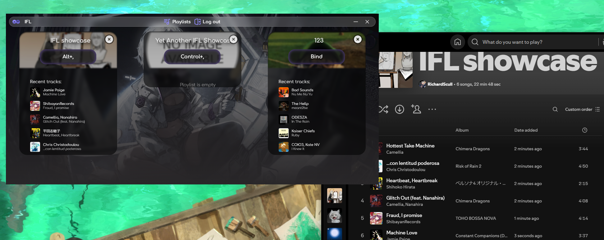

## IFL (I F#cking lazy)

### This is a partial rewrite of the original IFL (I F#cking lazy) application. Mostly UI / some buggy code clean up. 

#### Expected rewrite changes:

- [ ] MacOS build
- [ ] Bind to remove current song from playlist (or make it work on the same keybind, idk)

--------

#### Features

IFL - is a program build with electron & react with redux.

Main goal of this project is to help you be more productive with adding new songs to your spotify playlists :)

How it works?
- Download latest release. Install it. Login with your spotify account.
- Now you need to choose one or any amount of PUBLIC AND PRIVATE playlists you have.
- Simple add keybind to your chosen playlist & enjoy music!
- Press keybind when you hear song that touches you really deep and boom song will jump into your playlist.

#### Build

1. Clone the repository
2. Install dependencies
3. Clone the .env.example to .env and fill in your Spotify credentials
4. Start or build the application

#### License

MIT